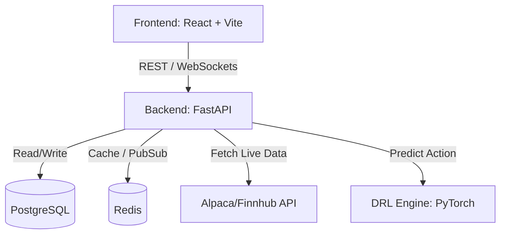

# Architecture: DRL Stock Trading App

This document describes the high-level architecture of the system.

## 1. System Overview
The application follows a standard three-tier architecture with real-time bidirectional communication via WebSockets for low-latency market data and trade executions.

## 2. Frontend Layer (React + Vite)
- **Framework**: React 18, Vite for fast HMR.
- **Styling**: TailwindCSS with custom design tokens for a premium, dark-mode financial aesthetic.
- **State Management**: Zustand for global state (Wallet, Portfolio), React Query for REST fetching, and custom WebSocket hooks for real-time streams.
- **Charting**: Lightweight Charts by TradingView for rendering OHLC (Open-High-Low-Close) candlesticks seamlessly.

## 3. Backend Layer (Python FastAPI)
- **Framework**: FastAPI (Asynchronous by default, making it ideal for WebSockets and ML integration).
- **Core Services**:
  - `MarketDataService`: Connects to external APIs, normalizes data, and pushes it to Redis Pub/Sub.
  - `OrderManagementService`: Validates user balance, executes virtual trades, and calculates real-time PnL.
  - `DRLInferenceService`: Loads the trained PyTorch model, normalizes incoming market data into a state vector, and runs model inference to produce an action (Buy/Sell/Hold).
- **WebSockets**: A dedicated `/ws/market` and `/ws/portfolio` endpoint to stream data to connected clients.

## 4. Data Layer (PostgreSQL & Redis)
- **PostgreSQL**: The source of truth for persistent data.
  - `users`: ID, username, password hash.
  - `portfolios`: user_id, cash_balance, total_equity.
  - `positions`: user_id, symbol, quantity, average_price.
  - `transactions`: user_id, symbol, type (BUY/SELL), quantity, price, timestamp.
- **Redis**: Used as an in-memory message broker. Market data comes in from Alpaca -> Python processes it -> Publishes to Redis -> FastAPI WebSocket endpoints consume from Redis and push to the React UI.

## 5. DRL Engine (PyTorch + FinRL)
- **Training Environment**: An offline Jupyter Notebook or Python script that uses FinRL (Financial Reinforcement Learning) to train an agent.
- **Algorithm**: PPO (Proximal Policy Optimization) or A2C.
- **State Space**: Current price, MACD, RSI, CCI, ADX, current shares held, available balance.
- **Action Space**: Continuous action `[-1, 1]`, where `< 0` implies selling up to `H` shares, and `> 0` implies buying up to `H` shares.
- **Reward Function**: Change in total portfolio value.
