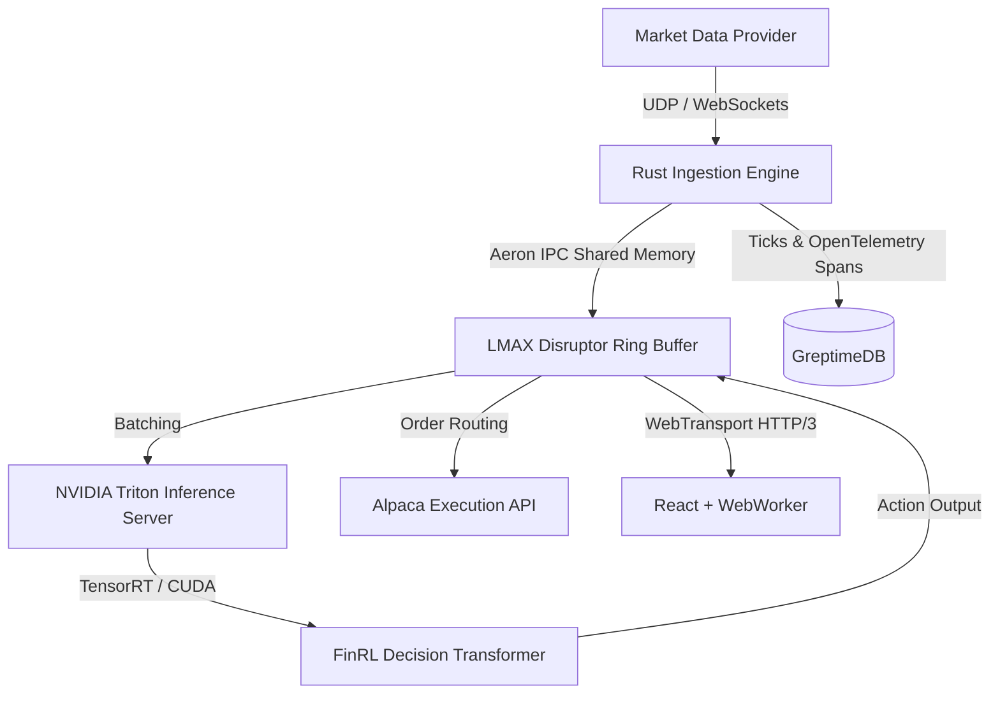

# Enterprise Architecture: DRL Stock Trading App

This document describes the high-performance, ultra-low-latency architecture of the system, engineered to institutional quantitative trading standards.

## 1. System Overview
The application utilizes a decoupled, hardware-accelerated architecture to achieve microsecond latency from market data ingestion to DRL inference and UI rendering.

## 2. Real-Time Data Streaming & IPC Backbone
- **Ingestion**: Written in **Rust** to guarantee memory safety without garbage collection pauses.
- **Message Bus**: **Aeron** is used for inter-process communication (IPC) via shared memory, completely bypassing the OS network stack.
- **Concurrency**: An **LMAX Disruptor** ring buffer acts as the central order book and event sequencer, utilizing hardware-level memory barriers to achieve zero-lock, zero-allocation messaging.

## 3. Time-Series & Observability Data Store
- **Database**: **GreptimeDB** (written in Rust, LSM-Tree architecture).
- **Purpose**: A unified multi-modal database replacing PostgreSQL/Redis. It simultaneously ingests high-frequency market ticks (Metrics) and nanosecond-resolution execution timestamps (OpenTelemetry Traces) for latency profiling.

## 4. DRL Engine (PyTorch + Triton)
- **Model Architecture**: **Decision Transformer (FinRL-DT)** utilizing a LoRA-adapted Large Language Model (GPT-2) for conditional sequence modeling.
- **Reward Shaping**: The agent optimizes for the **Differential Sharpe Ratio**, strictly penalizing transaction friction and volatility.
- **Inference**: Deployed on the **NVIDIA Triton Inference Server**. The PyTorch model is compiled to a **TensorRT** engine to enable dynamic batching and microsecond GPU execution.

## 5. Client-Server Transport & Frontend
- **Network Transport**: **WebTransport over HTTP/3 (QUIC)**. Market noise (ticks) is streamed via unreliable datagrams to eliminate Head-of-Line (HoL) blocking. Financial state (portfolio balances) uses reliable streams.
- **Frontend Framework**: React 18 + Vite.
- **Rendering Engine**: **SciChart.js** (WebAssembly/WebGL). Data parsing occurs inside a dedicated Web Worker that writes directly to a `SharedArrayBuffer`, synced to the UI via `requestAnimationFrame` for a flawless 60fps experience.
