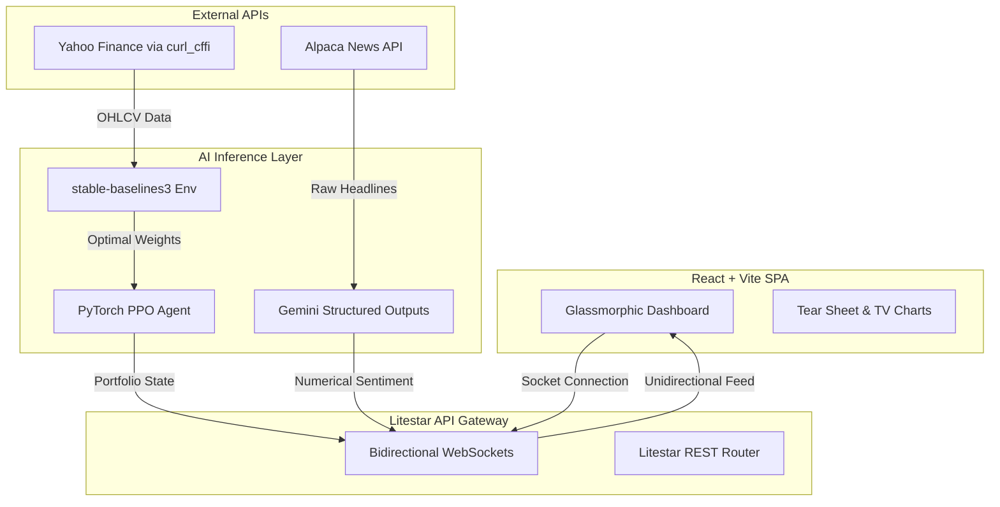

# System Architecture: DRL Stock Trading App

This application is built exclusively for Retail AI Trading, utilizing state-of-the-art Python and React ecosystems.

## Core Components

### 1. Python Litestar Backend
- **Framework**: `Litestar` (Chosen for speed and enterprise plugins).
- **Responsibility**: In-memory PyTorch inference, Alpaca News ingestion, curl_cffi Yahoo data ingestion, and orchestrating Bidirectional WebSockets.
- **Streaming**: Bidirectional WebSockets (`/ws/terminal-feed`) pushes portfolio weights, sentiment scores, and prices to the client without TCP Head-of-Line blocking.

### 2. DRL & AI Engine
- **Framework**: `stable-baselines3`, `gymnasium`, and `PyTorch`
- **Agent**: Proximal Policy Optimization (PPO).
- **Sentiment**: Gemini 1.5 Flash using Structured Outputs (Pydantic) for deterministic numerical extraction from live Alpaca News feeds.
- **Inference**: Handled in a background thread via `asyncio.to_thread` to prevent event loop blocking.

### 3. PostgreSQL Database (Supabase)
- **Role**: (Future Phase) Relational store for users, portfolio history, and raw OHLCV ticks.
- **Features**: Row Level Security (RLS) and built-in authentication ensuring tenant isolation.

### 4. React Vite Frontend
- **Framework**: React 18, Vite, TailwindCSS, Framer Motion.
- **Charting**: `TradingView Lightweight Charts` utilizing HTML5 Canvas for stutter-free 60fps rendering of large datasets, alongside `recharts` for asset Tear Sheets.
- **Data Fetching**: Native `WebSocket` API connecting to Litestar.

## System Diagram

